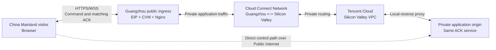

# Tencent Cloud Cloud Connect Network (CCN) Beginner Workshop

**Are you experiencing high latency when visitors in China Mainland access websites or applications hosted overseas?**

Official Tencent Cloud CCN documentation: [English](https://www.tencentcloud.com/document/product/1003/30049) | [Chinese](https://www.tencentcloud.com/zh/document/product/1003/30049)

This customer-facing workshop shows how to evaluate a controlled China Mainland public ingress and a CCN-connected private network segment to the same overseas application origin. CCN can provide private connectivity between associated Tencent Cloud network instances; this workshop helps you validate the configured application path before production planning.

> **Important:** do not present CCN as a guaranteed latency reduction or stability improvement. The actual result depends on the complete design, regions, ISP/last-mile path, application, bandwidth configuration, and test conditions. This workshop records functional Command-to-ACK evidence, not a CCN latency benchmark or SLA.

## Architecture: China Mainland visitor to overseas application



**Traffic flow:** the browser enters the public Guangzhou ingress, which forwards application traffic through the reviewed CCN private segment to the private Silicon Valley application origin. The matching ACK returns along the configured path. The dotted Direct control path reaches the same ACK service without the Guangzhou ingress and CCN segment.

### How CCN supports the optimization design

1. **Create a controlled on-ramp:** the visitor enters a Guangzhou public endpoint rather than connecting directly to the overseas application origin for the routed test.
2. **Connect the private cloud networks:** CCN associates the Guangzhou and Silicon Valley VPCs and provides the private network segment between them.
3. **Inspect routes and configure the eligible bandwidth path:** validate routes, security controls, approval, and bandwidth before allowing public routed traffic.
4. **Measure the complete application path:** compare Direct and routed Command-to-ACK results under matched China Mainland test conditions. This is how the team can determine whether the design improves its own latency and stability objectives; it is not assumed in advance.

**VERIFIED — CCN supports private connectivity between associated VPCs and automatically syncs route information in the CCN route table.** See Tencent Cloud [CCN Overview](https://www.tencentcloud.com/document/product/1003/30049). The end-to-end latency and stability outcome remains **customer-specific** and must be validated with the complete application and access network.

## New to CCN? Start the workshop

**[Open the beginner workshop guide ->](docs/START-HERE.md)**

It is the one guide to follow from beginning to end. It explains the goal, who this is for, what you need, each build step, expected results, common problems, and cleanup. **You do not need to understand the code or run Local Quick Start first.**

- **Want a 2-minute picture first?** Open the [visual field guide](docs/START-HERE.html).
- **Ready to create cloud resources?** Read [cost and safety](docs/cost-and-safety.md), then return to the beginner workshop guide.
- **Blocked on a technical step?** Open [technical reference](docs/REFERENCE.md) only for that step.

> **Business question this workshop helps answer:** Can we connect a controlled China Mainland public ingress to the same application origin in another Tencent Cloud region through a reviewed CCN private network path, validate application continuity, and identify what must be completed before production design or commercial evaluation?

The workshop records a result only after the browser receives a matching acknowledgement for the command it sent. It gives teams an evidence-based way to discuss topology, reachability, security boundaries, operational readiness, and the next CCN evaluation step.

> **Measurement boundary:** the displayed result is a Command-to-ACK round-trip application acknowledgement (RTT). It is **not** one-way latency, network RTT, CCN-link latency, throughput, jitter, packet loss, SLA evidence, a pricing statement, or a performance guarantee.

---

## Why customers consider CCN

As an application expands across regions, VPCs, accounts, or on-premises environments, simple point-to-point connectivity becomes harder to operate: teams must coordinate routes, private addressing, security controls, and changes across several network boundaries.

**VERIFIED — CCN can interconnect VPCs and VPCs with local IDCs through supported network instances; it automatically syncs associated-instance routes in its CCN route table.** This is the product foundation behind this workshop. See Tencent Cloud's [CCN Overview](https://www.tencentcloud.com/document/product/1003/30049) and [CCN Getting Started](https://www.tencentcloud.com/document/product/1003/31985) (reviewed 2026-09-15; confirm current account, region, and commercial eligibility before purchase).

This workshop demonstrates the following customer-relevant outcomes:

| Customer pain point | How CCN-oriented design helps | What this workshop proves — and does not prove |
|---|---|---|
| Application tiers are split across regions or VPCs | A CCN instance provides a private connectivity layer between associated networks, with routing inspected centrally. | **Proves:** a configured application path can return matching ACKs. **Does not prove:** a production design, capacity, or SLA. |
| A browser needs a China Mainland entry point while the application origin is private in another region | A public Guangzhou ingress can act as the controlled on-ramp; CCN is the private network segment behind it. | **Proves:** the intended ingress-to-private-origin topology is functionally reachable after validation. **Does not prove:** that a browser connects to CCN directly. |
| Teams want to avoid comparing different applications when evaluating paths | Direct and routed paths intentionally reach the **same** US ACK service. | **Proves:** a fairer functional control-versus-routed application test. **Does not prove:** a generalized speed improvement. |
| Network changes are difficult to explain to application stakeholders | The demo turns an abstract route design into a visible command and matching acknowledgement. | **Proves:** application-level continuity under the configured path. **Does not prove:** end-user experience under every ISP, device, or location. |

### The plain-language model

**The browser uses a public front door. CCN is the private highway between cloud networks.**

In this workshop, the Guangzhou EIP/CVM is the public front door. The Guangzhou-to-Silicon-Valley segment is the CCN-connected private network path. The Silicon Valley application remains a private origin behind that path.

---

## When CCN is a good fit

Use this workshop as a starting point when the customer has one or more of these conditions:

- **Multi-region or multi-VPC application architecture:** workloads in separate Tencent Cloud VPCs need private network connectivity and centrally inspectable routes.
- **Hybrid connectivity:** the customer needs to extend a private network design between Tencent Cloud VPCs and a supported local IDC connectivity model.
- **Controlled public ingress with private application tiers:** public users enter through a reviewed regional ingress while the origin service remains private.
- **China Mainland–related application topology:** the customer needs to assess an approved cross-border network design, its routing, security controls, and commercial prerequisites before production rollout.
- **PoC before commitment:** engineering, security, and business teams need a shared artifact to validate a functional path before discussing scale, rollout, or purchasing.

### When this workshop — or CCN alone — is not the answer

- You only need to make a public website load faster globally. Start with the appropriate edge delivery, DNS, origin, and application design assessment; CCN is not a browser-side acceleration switch.
- You expect a browser to connect directly to CCN. Browsers use public HTTPS/WSS endpoints; CCN is the private network connectivity layer between associated networks.
- You need a benchmark, guaranteed latency, or a pricing quote. Define a separate test plan and obtain account-specific commercial guidance.
- You have not yet resolved IP addressing, security, data handling, or regulatory requirements. Treat those as design inputs, not implementation details to postpone.

---

## What you will learn and validate

After completing the workshop, a new customer should be able to:

1. Explain the distinct roles of **browser, EIP, CVM, VPC, subnet, CCN, route table, public ingress, and private origin**.
2. Create a Direct control path and a separately configured routed path that both reach the same ACK service.
3. Plan non-overlapping VPC CIDRs, associate the required network instances, inspect the CCN route table, and verify private reachability before enabling routed WSS.
4. Understand the recommended CCN workflow: **create CCN -> associate network instances -> check routing -> configure applicable bandwidth**. [Official guide](https://www.tencentcloud.com/document/product/1003/31985).
5. Treat a matching ACK as an application-continuity signal — not a claim about network performance, SLA, or business outcome.
6. Apply minimum-exposure controls, document the test result, and clean up billable lab resources deliberately.

---

## From Workshop to a qualified CCN evaluation

This repository is deliberately designed to move a customer from a conceptual discussion to a well-scoped technical and commercial conversation — without pretending to be one-click production automation.

### 1. Qualify the use case

Before creating resources, capture the following with the customer's application, network, security, and procurement owners:

- Source and destination regions, user locations, and traffic direction.
- Current VPC/IDC topology, CIDR ranges, account ownership, and route dependencies.
- Public-entry requirements, private-origin ports/protocols, TLS ownership, and authentication model.
- Data residency, cross-border data-transfer, and industry compliance requirements.
- Expected traffic profile, availability target, operational owner, budget owner, and rollback plan.

### 2. Validate the smallest truthful topology

Build the Direct path first, then add the minimum routed components:

```text
Browser
  -> Guangzhou EIP + ingress CVM
  -> CCN association and reviewed routes
  -> Silicon Valley VPC private origin
  -> same ACK service
```

Do not configure `ccnPathWs` until private-origin reachability, TLS/WSS behavior, route health, security controls, and rollback steps have been verified.

### 3. Turn results into a production-design conversation

Bring the completed verification checklist and architecture notes to your Tencent Cloud account team or Solutions Architect. The useful next decisions are:

- Is CCN the correct connectivity model for this specific topology?
- Which network instances, regions, bandwidth model, and route controls are eligible for this account?
- What cross-border compliance, commercial, support, and security reviews apply?
- What production success criteria should be tested from representative user networks?
- Which resources will remain private, which endpoints must be public, and who owns lifecycle/rollback?

**VERIFIED — bandwidth configuration requires a created CCN instance, associated network instances, and no route conflict. Cross-border availability, billing mode, compliance process, and available region pairs are conditional.** Review [Configuring Bandwidth](https://www.tencentcloud.com/document/product/1003/38894) with the account team; do not infer eligibility, price, bandwidth entitlement, or approval from this repository.

---

## Start the workshop here

**Do not begin with Local Quick Start unless you are the technical owner.** New customers should follow one complete, beginner-first guide:

1. Read [Cost and safety guardrails](docs/cost-and-safety.md) before creating billable resources.
2. Follow [Start here: your first CCN cross-border workshop](docs/START-HERE.md) from Step 1 through Step 8. It explains the goal, audience, prerequisites, build sequence, expected result, and common questions in plain language.
3. Open the [visual field guide](docs/START-HERE.html) only if a diagram helps before you start.
4. Use [technical reference](docs/REFERENCE.md) only when a workshop step needs deployment, verification, or measurement detail.
5. Follow [cleanup procedure](docs/cleanup.md) when the lab ends.

Maintainers can use [release checklist](docs/release-checklist.md) before public GitHub changes.

---

## Workshop lifecycle

```text
1. Read cost and safety guardrails.
2. Run the local Direct-only demo.
3. Build and verify the US Direct origin.
4. Build Guangzhou ingress and complete applicable CCN prerequisites.
5. Verify the private path before enabling routed WSS.
6. Validate Direct and routed ACK behavior from a suitable test client.
7. Document findings, agree production evaluation next steps, and clean up resources.
```

Read [cleanup.md](docs/cleanup.md) **before** provisioning cloud resources. Terminating a CVM alone may not release every billable or publicly exposed resource.

---

## What is included

- Static customer-facing browser demo in `app/`.
- Bounded, Node 22 built-in-only WebSocket ACK service in `server/`.
- Protocol, architecture, deployment, security, test, and newcomer documentation in `docs/`.
- Sanitized Nginx examples for a US public demo origin and a Guangzhou ingress proxy.
- A Terraform **reference scaffold** with safe variables and an example `.tfvars` file.
- GitHub Actions checks for syntax, protocol behavior, and public configuration boundaries.

## What is intentionally not included

- Production domains, public/private IP addresses, CVM/VPC/EIP IDs, account IDs, certificates, SSH keys, or Terraform state.
- A claim that this repository creates or validates a CCN cross-border connection in your account.
- One-click Terraform for CCN cross-border compliance, bandwidth purchase, DNS, certificates, or production deployment.
- A price, capacity, network-performance, SLA, security-compliance, or business-outcome claim.

---

## Local quick start (technical owner only)

Requirements: Node.js 22+ and Python 3. No npm packages are required.

```bash
npm run smoke

HOST=127.0.0.1 \
PORT=8787 \
ALLOWED_ORIGINS=http://127.0.0.1:8080 \
npm start
```

In another terminal:

```bash
python3 -m http.server 8080 -d app
```

Open `http://127.0.0.1:8080`.

For a local Direct ACK test, append this query parameter to the page URL:

```text
?ws=ws://127.0.0.1:8787/ws
```

The query parameter is supported only for the Direct local-debug path. It cannot activate the routed path.

---

## Configure real endpoints safely

1. Leave the repository's `app/demo-config.js` with blank endpoint values.
2. Copy `app/demo-config.example.js` during deployment and replace only the two example WSS hostnames.
3. Use a reviewed Direct endpoint for `directWs`.
4. Enable `ccnPathWs` only after verifying the separate Guangzhou ingress, CCN route, Silicon Valley private-origin reachability, TLS/WSS, applicable compliance status, and rollback path.
5. Never place credentials or tokens in browser configuration or WebSocket URLs.

See [`docs/REFERENCE.md`](docs/REFERENCE.md) for evidence boundaries, deployment detail, and fair comparison conditions.

---

## Reference infrastructure

- [`infra/nginx/us-demo.conf.example`](infra/nginx/us-demo.conf.example) hosts the static demo and proxies the local Node service.
- [`infra/nginx/guangzhou-ingress.conf.example`](infra/nginx/guangzhou-ingress.conf.example) accepts only `/healthz` and `/ws`, then proxies to a US private origin with TLS/SNI verification enabled.
- [`infra/terraform/`](infra/terraform/) is a safe planning scaffold, not a representation of a deployed account.

Before testing a real routed path, complete the applicable Tencent Cloud cross-border compliance and commercial process. Verify topology and route health independently; server ACK metadata alone does not prove browser ingress or CCN routing.

---

## Validate before publishing changes

```bash
npm run smoke
```

Also scan staged changes for secrets and real deployment references. Never commit:

```text
*.pem, *.key, .env, terraform.tfstate*, cloud resource IDs, real IP addresses, production domains, or live endpoint configuration
```

See [`SECURITY.md`](SECURITY.md) for deployment constraints and responsible disclosure guidance.

## License

[MIT](LICENSE)
