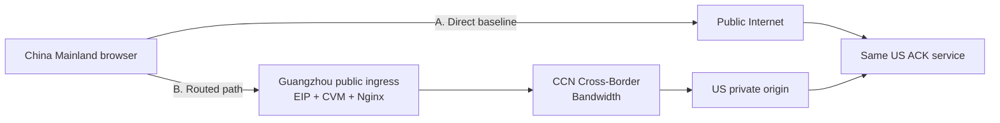

# Start Here: Build your first CCN cross-border demo

This guide is for a **new Tencent Cloud customer** who has a service in the United States and wants to demonstrate a controlled China Mainland ingress → CCN → US private-origin path.

It assumes this use case:

```text
China Mainland browser user -> Guangzhou ingress -> CCN Cross-Border Bandwidth -> US application origin
```

It is **not** a guide for accelerating users outside China Mainland into a China Mainland website, and it does not claim that CCN is a browser-side setting.

> **Plain-language model:** CCN is the private highway between your cloud networks. A browser cannot drive onto that highway by itself. You must give the browser a public on-ramp (the Guangzhou ingress EIP/CVM), then proxy it onto the CCN private route to the US origin.

Before you build, read [CCN basics for first-time Tencent Cloud customers](ccn-basics.md). It explains when this pattern fits, the resources each part of the architecture needs, and the small set of CCN concepts you should understand first.

## Step 0 — Confirm that this is the right CCN scenario

Use this demo when the customer story is: **China Mainland browser users need a controlled ingress path to the same US-hosted application origin**, or when you need a small functional lab to learn multi-region VPC connectivity.

Do not use it as a generic CDN demo, a one-CVM website tutorial, or a promise that CCN automatically improves every browser measurement. The target of this demo is **functional architecture and validation discipline**:

```text
public ingress -> private CCN-connected segment -> same application origin
```

If that is the intended topology, continue to the resource checklist below.

---

## The architecture in one minute

There are two routes that deliberately reach the **same US ACK service**:



```text
A. Direct control path
Browser -> Public Internet -> US ACK service

B. Routed CCN path
Browser -> Guangzhou public ingress -> CCN -> US private ACK service
```

Why two paths? The Direct route is your control. The routed route tests whether your configured topology works. Keeping the US ACK service the same avoids accidentally comparing two different applications.

The demo records a browser **Command-to-ACK application RTT** after a matching acknowledgement returns. It proves an application exchange happened. It is not a CCN-link latency measurement, one-way latency, SLA, or performance guarantee.

---

## What you need before you start

| Item | Why you need it | Where it belongs |
|---|---|---|
| Tencent Cloud account | Owns resources and approval workflow | Your Tencent Cloud organization |
| US VPC + CVM | Hosts the static demo and Node ACK service | A US Tencent Cloud region |
| China Mainland VPC + CVM + EIP | Public browser on-ramp for the routed path | Guangzhou in this reference architecture |
| CCN instance | Connects the two VPCs through private routing | CCN console |
| Cross-border compliance and bandwidth approval | Enables the applicable cross-border CCN service | CCN console / approved commercial workflow |
| Two DNS names + TLS certificates | Separates Direct and routed WSS endpoints | Your DNS zone and certificates |
| A China Mainland test client | Makes a customer-relevant comparison possible | Real user network is best |

### Three non-negotiable design rules

1. **Use non-overlapping VPC CIDRs.** Example: China Mainland `10.10.0.0/16`; US `10.20.0.0/16`.
2. **Use a separate public hostname for the routed ingress.** The browser should connect to the Guangzhou endpoint only when it selects the routed path.
3. **Keep the Node ACK service private on loopback.** Nginx terminates public TLS/WSS and proxies to it.

---

## Build order: do it in this sequence

### Step 1 — Run the demo locally first

Before spending on cloud resources, verify the app and the ACK protocol locally:

```bash
npm run smoke

HOST=127.0.0.1 \
PORT=8787 \
ALLOWED_ORIGINS=http://127.0.0.1:8080 \
npm start
```

In another terminal:

```bash
python3 -m http.server 8080 -d app
```

Open `http://127.0.0.1:8080?ws=ws://127.0.0.1:8787/ws`.

**Expected result:** the Direct path shows a connected state and a real ACK sample after a command. The CCN path stays unavailable because no routed endpoint exists yet.

---

### Step 2 — Build the US origin and prove the Direct baseline

In a US Tencent Cloud region:

1. Create a VPC and a CVM.
2. Install Node.js 22 and Nginx.
3. Run `server/server.js` on `127.0.0.1:8787`.
4. Put only `app/index.html`, `app/app.js`, `app/styles.css`, and a deployment-time `app/demo-config.js` into a dedicated Nginx web root.
5. Add a public EIP, a DNS record such as `demo.example.com`, and a TLS certificate.
6. Start with this configuration:

```js
window.CCN_DEMO_CONFIG = Object.freeze({
  directWs: "wss://demo.example.com/ws",
  ccnPathWs: "",
  defaultMode: "direct",
});
```

7. Load the page from the public Direct hostname and send ten sequential commands.

**Expected result:** the Direct path records ten matching ACKs. Do not call that number CCN performance; this is only the control path and application-level measurement.

Use [`../infra/nginx/us-demo.conf.example`](../infra/nginx/us-demo.conf.example) as a starting point. Do not make your entire project directory the Nginx document root; publish browser assets only.

---

### Step 3 — Build the China Mainland ingress

In Guangzhou for this reference architecture:

1. Create a VPC and subnet that do not overlap with the US VPC.
2. Create an ingress CVM and associate an EIP.
3. Permit only the required public ports, normally HTTPS/WSS on `443`, plus restricted administration access.
4. Create a **separate** routed hostname, for example `ccn-path.example.com`, pointing at the Guangzhou EIP.
5. Obtain a TLS certificate for that hostname.

At this point, the Guangzhou CVM is a front door for `/healthz` and `/ws`. It does **not** host the browser website. Returning `404` for `/` is intentional.

---

### Step 4 — Create CCN and complete cross-border prerequisites

In the CCN console:

1. Create a CCN instance.
2. Associate the Guangzhou VPC and the US VPC.
3. Check that routes for the opposite VPC CIDR are learned/selected and there is no overlap or conflict.
4. In **Bandwidth Management**, complete the applicable `CCN Cross-Border Sales Compliance Check` when prompted.
5. After approval and according to the applicable commercial flow, configure the cross-border bandwidth for the Guangzhou ↔ US region pair.
6. Record the approval, bandwidth configuration, and route status in your project evidence.

Tencent Cloud's CCN bandwidth documentation states that creating and associating network instances plus configuring bandwidth are prerequisites for normal communication. Cross-border availability, eligibility, billing, bandwidth limits, approval timing, and supported region pairs are account- and product-condition dependent. Check the current console and official documentation before ordering:

- [CCN bandwidth configuration (Tencent Cloud)](https://www.tencentcloud.com/document/product/1003/38894)
- [CCN documentation index (Tencent Cloud International)](https://intl.cloud.tencent.com/document/product/1003/47565)

**Do not treat Terraform as a substitute for this approval.** Infrastructure-as-code can describe VPCs, CVMs, security groups, and inputs; it does not itself obtain cross-border compliance or commercial approval.

---

### Step 5 — Prove private reachability before exposing the routed endpoint

From the Guangzhou ingress CVM, verify that it can reach the **US private IP** of the origin over the expected protocol. For HTTPS health checks, preserve the hostname/SNI expected by the US certificate:

```bash
curl --resolve demo.example.com:443:US_PRIVATE_IP \
  https://demo.example.com/healthz
```

Only proceed when this returns the expected health JSON. If this step fails, troubleshoot VPC CIDRs, CCN association, route tables, security groups, upstream listener, and TLS/SNI before testing from a browser.

---

### Step 6 — Configure the Guangzhou Nginx reverse proxy

Configure Nginx at the Guangzhou ingress to:

```text
Public WSS /ws
  -> Guangzhou Nginx
  -> CCN private route
  -> US private origin HTTPS /ws
  -> Node ACK service
```

Use [`../infra/nginx/guangzhou-ingress.conf.example`](../infra/nginx/guangzhou-ingress.conf.example) as a starting point.

Important safety controls:

- Expose `/healthz` and `/ws` only.
- Retain `proxy_ssl_verify on` and `proxy_ssl_name` for the US origin.
- Do not disable upstream certificate verification just to make a TLS error disappear.
- Keep the routed hostname separate from the static page hostname.

---

### Step 7 — Enable the routed endpoint in the static demo

After Steps 1–6 are verified, create the deployment-time configuration:

```js
window.CCN_DEMO_CONFIG = Object.freeze({
  directWs: "wss://demo.example.com/ws",
  ccnPathWs: "wss://ccn-path.example.com/ws",
  defaultMode: "direct",
});
```

The repo version intentionally uses blank endpoint values. Do not commit your live hostname, tokens, IPs, or account identifiers.

**Expected result:** selecting CCN Cross-Border Bandwidth changes the status to `CCN ROUTED TEST CONNECTED`. A command then records a `REAL ROUTED ACK RTT` only after a matching ACK is received.

---

### Step 8 — Run a fair customer test

For every comparison, use the same:

- China Mainland client and access network;
- browser and browser version;
- command payload and command count;
- US application origin and backend version; and
- time window.

Run Direct first, then the routed path. Preserve both successes and failures. A US client can validate configuration and functional continuity, but it cannot represent China Mainland user experience.

See [`test-methodology.md`](test-methodology.md) for the reporting format and [`verification-checklist.md`](verification-checklist.md) for the complete go/no-go validation sequence.

---

## Customer demo talk track

Use this short sequence:

1. **Problem:** “A China Mainland user reaching a US service normally enters through the public Internet.”
2. **Design:** “For the configured path, the browser enters our Guangzhou ingress, then the traffic uses a private CCN-connected segment to the same US origin.”
3. **Control:** “Both paths end at the same acknowledgement service, so the application target stays constant.”
4. **Proof:** “Each displayed sample is real only after the browser receives the matching ACK.”
5. **Boundary:** “This validates configured application continuity. It is not a standalone claim about CCN-link latency, SLA, or guaranteed improvement.”

---

## Troubleshooting: where to look first

| Symptom | First check |
|---|---|
| Direct path unavailable | US Nginx, Node service health, DNS/TLS, `ALLOWED_ORIGINS` |
| Routed path unavailable | Routed DNS/TLS, Guangzhou Nginx error log, public EIP/security group |
| Guangzhou returns `502` | Private origin reachability, CCN routes, upstream TLS/SNI verification |
| `/healthz` works from Guangzhou but browser WSS fails | Public ingress certificate/SNI, Nginx WebSocket headers, browser console, EIP/network path |
| Routed page root returns `404` | Expected if Guangzhou only exposes `/healthz` and `/ws` |
| The browser shows an RTT after failure | Treat as a defect; failed, malformed, unmatched, or timed-out commands must create no successful sample |

---

## Terraform: when to add it

Use Terraform only after you can reproduce the topology manually once. Start with VPCs, subnets, CVMs, EIPs, and security groups. Keep CCN cross-border compliance and bandwidth approval as explicit human-controlled gates.

The repo's [`../infra/terraform/`](../infra/terraform/) folder is a safe reference scaffold, not a promise of one-click cross-border provisioning.
